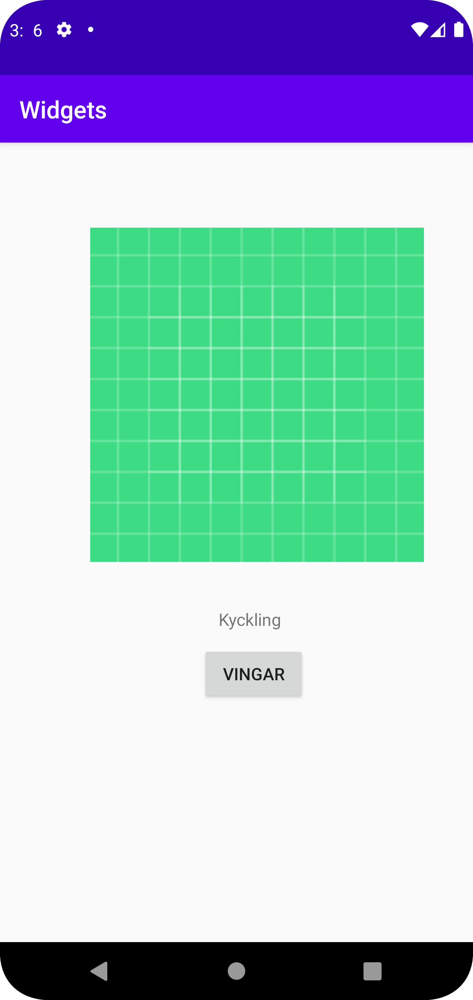

# Rapport

** Först valdes en constraint layout. Mina tre widgets var textview, image view och en button. I dessa widgets ändrades innehållet samt positioneringen på de. En bild importerades med hjälp av en drawable bild, dessutom sågs det till att margin ändrades för alla komponeneter genom att ändra defualt margin i design sidan. Exempel cod på image view visas nedan.  **


```
<ImageView
        android:id="@+id/imageView"
        android:layout_width="277dp"
        android:layout_height="340dp"
        android:layout_marginBottom="284dp"
        app:layout_constraintBottom_toBottomOf="parent"
        app:layout_constraintHorizontal_bias="0.649"
        app:layout_constraintLeft_toLeftOf="parent"
        app:layout_constraintRight_toRightOf="parent"
        app:srcCompat="@drawable/ic_launcher_background" />
```

Bilder läggs i samma mapp som markdown-filen.


  
Läs gärna:

- Boulos, M.N.K., Warren, J., Gong, J. & Yue, P. (2010) Web GIS in practice VIII: HTML5 and the canvas element for interactive online mapping. International journal of health geographics 9, 14. Shin, Y. &
- Wunsche, B.C. (2013) A smartphone-based golf simulation exercise game for supporting arthritis patients. 2013 28th International Conference of Image and Vision Computing New Zealand (IVCNZ), IEEE, pp. 459–464.
- Wohlin, C., Runeson, P., Höst, M., Ohlsson, M.C., Regnell, B., Wesslén, A. (2012) Experimentation in Software Engineering, Berlin, Heidelberg: Springer Berlin Heidelberg.
